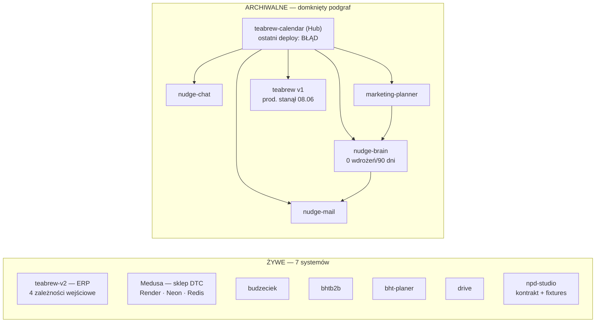
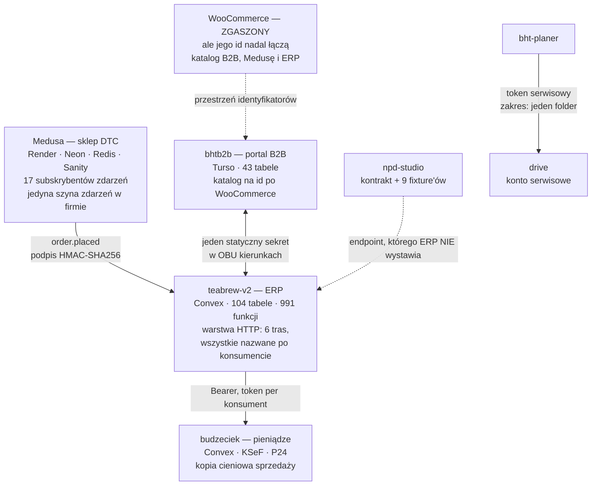
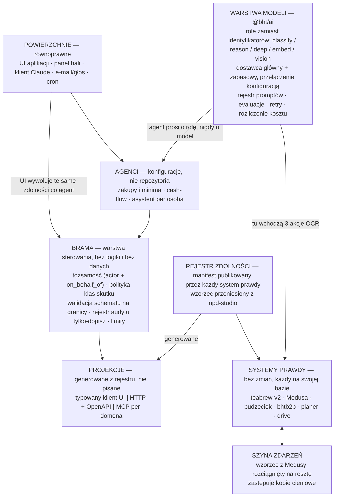

# Siedem systemów żywych, dziesięć martwych, jedna brakująca warstwa

**Audyt majątku systemowego i architektura docelowa · Brown House & Tea · 16.08.2026**

Klasyfikacja wszystkich 17 repozytoriów po aktywności, wdrożeniach i zależnościach — nie po dacie
commita. Potem architektura obecna, tylko na systemach żywych. Na końcu stan docelowy, w którym
AI jest warstwą możliwości, oraz mapa 30 dni / 3 miesiące / rok.

> **Wersja 2.** Wersja 1 tego dokumentu opierała się na założeniu, że duże i niedawno dotykane
> znaczy żywe. Dane o wdrożeniach i zależnościach obaliły to w trzech punktach — zestawienie
> w rozdziale 3. Wersja 1 jest unieważniona.

> **Uwaga o zakresie tego pliku.** Repozytorium `nudge-chat` jest publiczne, dlatego wersja
> tekstu tutaj jest oczyszczona: bez nazw wdrożeń, identyfikatorów projektów, nazw zmiennych
> z sekretami i adresów produkcyjnych. Wnioski są kompletne, szczegóły techniczne pozostają
> w wersji prywatnej.

---

## 1. Metoda oceny — cztery sygnały, nie jeden

Data ostatniego commita kłamie w obie strony: automat commitujący backupy udaje życie, a system
bez commitów może obsługiwać całą halę. Dlatego każde repozytorium oceniam czterema niezależnymi
sygnałami.

| Sygnał | Co mierzy | Skąd |
|---|---|---|
| **1 · Tempo** | Commity w oknach 30/90/180 dni i liczba miesięcy z aktywnością. Rozdziela ciągły rozwój od jednego zrywu, po którym cisza. | `git log` po pogłębieniu historii |
| **2 · Wdrożenia** | Czy wdrożenia produkcyjne faktycznie wychodzą i czy kończą się sukcesem. Rozstrzyga przypadki, których commity nie rozstrzygają. | Vercel API — lista wdrożeń, cel, stan |
| **3 · Zależności wejściowe** | Ile *żywych* systemów woła ten system. Zero zależności od żywych = repozytorium jest liściem, choćby było duże. | Graf odwołań między repozytoriami |
| **4 · Ślad operacyjny** | Konfiguracja wdrożenia, CI, harmonogramy, kontrakty, testy. Odróżnia aplikację od zrzutu plików. | Pliki konfiguracji wdrożeń, workflowy, `contracts/` |

Dwa przypadki pokazują, dlaczego jeden sygnał nie wystarcza:

- **TeaBrew v1** ma wdrożenia jeszcze z 17 czerwca — ale wszystkie z gałęzi `backups`, z commitami
  o nazwach `backup: backup-2026-06-…json`, jako podglądy, nie produkcja. Produkcja stanęła
  8 czerwca; potem automat jeszcze dziewięć dni palił buildy.
- **bhtb2b** ma tylko 9 commitów w 30 dni, co wygląda na wygasanie — a to 9 wdrożeń produkcyjnych,
  wszystkie udane, każde naprawiające żywy przepływ pieniędzy. Mało commitów, wysoka stawka.

### Granica wiarygodności

Aktywność repozytorium i historia wdrożeń mówią, czy ktoś ten system **rozwija**. Nie mówią, czy
ktoś go **używa**. Nie mam wglądu w ruch produkcyjny ani w liczniki baz, a Web Analytics nie jest
włączony na tych projektach. Tam, gdzie klasyfikacja zależy od tej różnicy, zaznaczam to wprost.

---

## 2. Klasyfikacja — 7 żywych, 10 do zamknięcia

| | Liczba | Skala |
|---|---|---|
| Systemy żywe | 7 | ~494 tys. LOC |
| Archiwalne, wygaszane | 6 | ~274 tys. LOC |
| Martwe | 4 | w tym 1 puste repozytorium |
| Wywołania AI w całym żywym majątku | **3** | trzy akcje OCR |
| Żywi konsumenci klastra Nudge | **0** | — |
| Projekty Vercel na 17 repozytoriów | 19 | nadmiar do sprzątnięcia |

### Strategiczne — rdzeń firmy, inni od nich zależą

| System | Tempo | Zależności wej. | Rola i stos |
|---|---|---|---|
| **teabrew-v2** | 178 commitów w 14 dniach | **4** | ERP: partie, magazyn, produkcja, HACCP, GS1, wysyłki, kanały. 290 tys. LOC, 104 tabele, 991 funkcji. **Centrum grafu.** Convex + Vercel |
| **bht-next-prototype** | 164 commity w 26 dniach | 2 | Sklep DTC na Medusa v2 — monorepo: backend, storefront, studio (Sanity), admin. 96 tys. LOC, 17 subskrybentów zdarzeń, 14 zadań cyklicznych, 5 własnych modułów. Render + Postgres na Neon + Redis, Stripe, Przelewy24 |
| **budzeciek** | 190 commitów w 9 dniach | 1 | Pieniądze: koszt kanoniczny, cash-flow, KSeF, transakcje bankowe. 32 tys. LOC, 16 tabel. Convex |

### Aktywnie rozwijane — młode, szybkie, jeszcze bez konsumentów

| System | Tempo | Zależności wej. | Rola |
|---|---|---|---|
| **bht-planer** | 84 commity w 20 dniach (start 27.07) | 0 | Kalendarz treści, media, Instagram, inspiracje, zadania. 23 tys. LOC, 34 tabele. Jedyne wyjście: Drive |
| **drive** | 17 commitów/30 dni, **20 udanych wdrożeń produkcyjnych/90 dni** | 1 | Dysk firmowy z działami jako granicą widoczności, wersje plików, kosz z retencją, udostępnienia, baza wiedzy. 11 tys. LOC |

### Produkcyjne, utrzymywane — mało zmian, każda na żywym pieniądzu

| System | Tempo | Zależności wej. | Charakter zmian |
|---|---|---|---|
| **bhtb2b** | 9 commitów/30 dni, **9 udanych wdrożeń produkcyjnych** | 2 | Portal B2B: zamówienia, rabaty per klient, CRM, kupony, czat obsługi, zgłoszenia. 38 tys. LOC, 43 tabele. Ostatnie zmiany to naprawy przepływu zamówień do ERP i systemu księgowego — zaokrąglenia do grosza, dublujące się pozycje, wyłączenie martwego sklepu WooCommerce. **Spadek tempa to dojrzałość, nie wygaszanie** |

### Eksperymentalne — i jednocześnie najdojrzalsze procesowo

| System | Tempo | Zależności wej. | Dlaczego jest ważne |
|---|---|---|---|
| **npd-studio** | 6 commitów w 1 dniu (07.08) | 0 | Rozwój nowych produktów. 4,3 tys. LOC, 13 tabel, dostęp zamknięty listą adresów. **Ma to, czego nie ma żaden inny system: pisany, wersjonowany kontrakt integracyjny** z 9 fixture'ami wraz z przypadkami negatywnymi, manifestem, sumą kontrolną zestawu, osobnym tokenem per aplikacja i testami kontraktu w CI |

### Archiwalne — wygaszane, zero żywych konsumentów

| System | Ostatnie życie | Dowód zamknięcia | LOC |
|---|---|---|---|
| **teabrew** (ERP v1) | produkcja 08.06, automat 17.06 | Zastąpiony przez v2. Po 8 czerwca tylko automat commitował dzienne backupy, każdy palił podglądowy build. Zero żywych konsumentów | 137 tys. |
| **teabrew-calendar** (Nudge Hub) | 28.07 | **Ostatnie wdrożenie produkcyjne zakończyło się błędem i nikt go nie naprawił.** 166 commitów w 180 dni, z tego 1 w ostatnich 90. Zero żywych konsumentów. 155 route'ów, 65 tabel, 32 wywołania AI | 73 tys. |
| **bht-marketing-planner** | 30.04 | Zero commitów od kwietnia. Jedyny konsument — Hub — sam archiwalny. Funkcję przejął `bht-planer` | 25 tys. |
| **nudge-brain** | 28.04 | **Zero wdrożeń w ostatnich 90 dniach** — potwierdzone. Baza wiedzy z RAG. Konsumenci: Hub i marketing-planner, oba archiwalne | 18 tys. |
| **nudge-mail** | 20.04 | Zero commitów od kwietnia. Wołany tylko przez Hub i Brain | 13 tys. |
| **nudge-chat** | 23.05 | Zero commitów w 30 dniach. Czat B2B w `bhtb2b` to osobna implementacja, nie ten system | 8 tys. |

### Martwe — do zamknięcia bez analizy

| Repozytorium | Stan |
|---|---|
| **b2b-brownhouse** | Pierwotny portal B2B w PHP. Zastąpiony przez `bhtb2b`. Ostatni commit 09.03 |
| **b2b-brownhousebest** | Porzucone przepisywanie tego samego portalu: `package.json` bez ani jednej zależności, w zamian pięć plików z raportami o ukończeniu. Ostatni commit 09.03 |
| **Teablender** | Nie jest aplikacją — brak `package.json`, w środku tylko `config`, `layout`, `locales`, `templates`. Jeden commit: „Add files via upload" |
| **CalendarPWA** | **Puste repozytorium. Zero commitów.** Zajmuje nazwę i nic więcej |

### Klaster Nudge jest domkniętym podgrafem



**Zero krawędzi z prawej do lewej.** Klaster Nudge można odłączyć w jednym ruchu — nic żywego nie
przestanie działać. Tam leży 274 tys. linii i cała warstwa AI firmy: 36 wywołań modelu, RAG,
13 narzędzi agenta.

Zastrzeżenie: to dowód, że nikt tych systemów nie **rozwija**. Czy ktoś ich jeszcze **używa**,
rozstrzygną liczniki baz i logi — pozycja 1 mapy 30-dniowej.

---

## 3. Co odwracam z wersji 1

| Wersja 1 twierdziła | Faktycznie |
|---|---|
| Warstwa AI istnieje i wymaga naprawy: 36 wywołań modelu, 7 zahardkodowanych identyfikatorów, trzy konwencje klienta. Zadanie to refaktor. | W żywym majątku AI praktycznie **nie ma**: trzy akcje OCR w ERP i nic więcej. Wszystkie 36 wywołań, RAG i 13 narzędzi agenta leżą w archiwalnym klastrze Nudge. To nie refaktor, a **budowa od zera na dojrzałym majątku operacyjnym** — inne ryzyka, inna kolejność, inny koszt. |
| Nudge Hub jest de facto centrum firmy i naturalnym miejscem na interfejs AI. | Hub jest archiwalny, a jego ostatnie wdrożenie produkcyjne **zakończyło się błędem, którego nikt nie naprawił**. Centrum grafu jest `teabrew-v2` z czterema zależnościami wejściowymi. |
| Najgorsze sprzężenie to wspólna baza między Hubem a Chatem, z surowym SQL przez granicę. | Oba systemy archiwalne, problem nieaktualny. **W żywym majątku nie ma ani jednej wspólnej bazy** — każda integracja idzie po HTTP. Punkt wyjścia jest istotnie zdrowszy. |
| Backend sklepu stoi na Railway. | Railway zniknął po awarii 19.05.2026. Backend Medusy stoi na **Render** (Frankfurt), Postgres na **Neon** (eu-central-1), Redis na Render. |
| Trzeba wprowadzić kontrakty integracyjne — nowa praktyka do zaszczepienia. | Kontrakt już **istnieje** w `npd-studio`: nazwany, wersjonowany, z fixture'ami dla przypadków negatywnych, sumą kontrolną, osobnym tokenem per aplikacja i testami w CI. Rekomendacja zmienia się z „wymyśl" na **„uogólnij to, co już działa"**. |

Co przetrwało weryfikację: głębia modelu domenowego w ERP, trafność wyboru Convex i Turso,
dyscyplina wdrożeniowa w `teabrew-v2`, rozdrobnienie tożsamości (sześć niezależnych systemów
uwierzytelniania) oraz to, że endpointy integracyjne są nazwane po konsumencie, nie po domenie.

---

## 4. Architektura obecna — tylko systemy żywe



**Pięć krawędzi, cztery różne modele zaufania.** Medusa podpisuje treść HMAC-SHA256 — to jedyna
krawędź zrobiona porządnie i wzorzec do skopiowania. B2B i ERP dzielą *jeden* statyczny sekret
w obu kierunkach, więc jego wyciek otwiera i odczyt stanów, i zapis zamówień. Budżeciek ma własny
token i kopię cieniową. Planer i Drive tworzą osobną wyspę.

### Kontrakt zadeklarowany jednostronnie

`npd-studio` odpytuje endpoint katalogowy na ERP-ie, z osobnym tokenem, i ma na to fixture'y oraz
testy. W `teabrew-v2` nie ma ani jednego odwołania do NPD, a jego warstwa HTTP wystawia sześć tras
i żadna z nich to nie jest. **Konsument został zbudowany pod kontrakt, którego dostawca nie
zaimplementował.** Sama dyscyplina jest wzorowa — ale obowiązuje po jednej stronie, więc nie chroni
jeszcze przed niczym.

### Tożsamość: sześć systemów w siedmiu aplikacjach

| System | Uwierzytelnianie ludzi | Uwierzytelnianie maszyn |
|---|---|---|
| teabrew-v2 | Convex Auth + PIN dla hali (dwa poziomy) | Trzy osobne tokeny + jeden sekret HMAC |
| Medusa | Własne konta klientów i personelu | Sekret HMAC do ERP, klucz admina, sekret odświeżania |
| budzeciek | Convex Auth + warstwa Auth.js | Bearer do ERP |
| bhtb2b | Własny JWT + bcrypt | Ten sam statyczny sekret w obu kierunkach |
| bht-planer | Własne sesje + bcrypt | Token serwisowy do Drive |
| drive | `next-auth`, wymuszona zmiana hasła, limit prób logowania | **Konto serwisowe bez możliwości logowania**, token o zakresie jednego folderu |
| npd-studio | Convex Auth, dostęp listą adresów | Osobny token per aplikacja |

Nie da się dziś odpowiedzieć w jednym miejscu, co dana osoba może zrobić w firmie. Dla ludzi to
niewygoda. Dla agenta AI to blokada: nie ma czego odziedziczyć, więc agent musiałby dostać albo
pełne prawa, albo żadne.

---

## 5. Trzy incydenty, jedna przyczyna

Nie hipotezy — zdarzenia opisane w historii commitów, z konsekwencjami finansowymi.

```mermaid
graph TB
    A["Allegro — obniżone ceny<br/>Ceny wszystkich ofert zmienione<br/>przez zewnętrzny system.<br/>Dwa dni sprzedaży po zaniżonych cenach.<br/>SPRAWCY NIE USTALONO"]
    B["Zamówienie BHT-5776<br/>Do ERP poszło 12 pozycji i 170 szt.<br/>zamiast 5 i 75 — nieusunięty<br/>snapshot sprzed edycji biura.<br/>KONTRAKT BEZ WALIDACJI PRZEPUŚCIŁ"]
    C["„AI Organizuj\" w Drive<br/>Funkcja przekładała pliki sama.<br/>Człowiek i tak musiał sprawdzać,<br/>gdzie co wylądowało.<br/>USUNIĘTA wraz z SDK"]
    X["Ta sama luka: żaden zapis w tej firmie nie jest jednocześnie<br/>PRZYPISANY, ZWALIDOWANY i ODWRACALNY"]
    A --> X
    B --> X
    C --> X
```

- **Atrybucja.** Audyt obu repozytoriów ERP wykazał zero ścieżek zapisu we własnym kodzie, dodano
  twardy blok na metody zapisu — ale źródła zmiany cen nie udało się wskazać.
- **Walidacja.** Granica między portalem B2B a ERP przyjęła zdublowane pozycje, bo nie sprawdzała
  schematu ani niezmiennika.
- **Odwracalność.** Jedyny z trzech przypadków, który firma rozwiązała — rezygnując z funkcji.

### To najważniejsze ustalenie całego audytu

Usunięcie „AI Organizuj" z Drive to nie porażka modelu — to porażka **obudowy**. Uzasadnienie
w commicie jest precyzyjne: funkcja przekładała pliki po swojemu, a człowiek i tak musiał potem
sprawdzić, gdzie co wylądowało. Dokładnie to samo powtórzy się z każdym agentem AI dołożonym do
ERP, budżetu czy sklepu, dopóki wcześniej nie powstanie warstwa, która każdy zapis przypisuje,
waliduje i pozwala cofnąć.

**Kolejność jest odwrotna do intuicyjnej: najpierw rozliczalność zapisów, dopiero potem AI.**
Wtedy AI wchodzi jako kolejny uprawniony konsument, a nie jako wyjątek proszący o zaufanie.

---

## 6. Mocne strony — na czym budować

Warstwa docelowa nie jest w tej firmie obcym pomysłem. Wszystkie jej elementy już gdzieś istnieją,
każdy w jednym miejscu. Brakuje ich uwspólnienia, nie wynalezienia.

| Element warstwy docelowej | Gdzie już działa | Co z tym zrobić |
|---|---|---|
| **Wersjonowany kontrakt z fixture'ami** | `npd-studio` — nazwany kontrakt, 9 fixture'ów z przypadkami negatywnymi, manifest z sumą kontrolną, testy w CI | Podnieść do standardu firmowego. Zacząć od domknięcia go po stronie ERP |
| **Podpisywanie żądań** | Medusa → ERP, HMAC-SHA256 na treści, retry z narastającym odstępem, jawny tryb awarii | Zastąpić tym wzorcem trzy krawędzie na statycznych tokenach |
| **Tożsamość maszynowa** | Drive — konto serwisowe bez możliwości logowania, token o zakresie jednego folderu, porównanie czasowo stałe, 404 zamiast 403 | Gotowy model poświadczeń dla agenta. Skopiować, nie projektować od nowa |
| **Szyna zdarzeń** | Medusa — 17 subskrybentów, 14 zadań cyklicznych, własne moduły i workflowy | Jedyna działająca szyna w firmie. Wzorzec propagacji zamiast kopii cieniowych |
| **Dyscyplina wdrożeniowa** | `teabrew-v2` — kontrakt repozytorium, guard przed wdrożeniem, osobny bezpieczny build | Rozszerzyć na pozostałe repozytoria strategiczne |
| **Myślenie niezmiennikami** | `teabrew-v2` — zapytania audytujące spójność danych i stanów magazynowych | Gotowa podstawa pod walidację na granicy zdolności |
| **Twardy blok na niebezpieczne operacje** | ERP — blokada metod zapisu na kliencie kanału sprzedaży po incydencie cenowym | To już jest „klasa skutku" wymuszona w kodzie, tylko ręcznie i w jednym miejscu. Uogólnić |

Czego nie ruszać: Convex pod ERP i budżet, Turso pod aplikacje wokół, Render z Neonem pod sklep,
prywatny magazyn plików. Przy tym zespole to właściwy kompromis między kosztem a brakiem obsługi
infrastruktury.

---

## 7. Architektura docelowa — AI jako warstwa możliwości

### Reguła: jedna definicja, dwie publiczności

Każda operacja biznesowa jest definiowana **raz**, jako **zdolność**, i z tej jednej definicji
*generowane* są zarówno klient dla interfejsu użytkownika, jak i narzędzie dla agenta. Nie „API
plus opakowanie dla AI" — ta sama rzecz. Dzięki temu wymóg „każda nowa funkcja dostępna i dla
człowieka, i dla agenta" jest spełniony strukturalnie, a nie dyscypliną, która pęka przy pierwszym
pilnym wydaniu.

Zdolność to nie endpoint. Endpoint mówi, jak coś wywołać. Zdolność mówi też, **kto może**,
**co się stanie** i **jak to cofnąć**:

```
nazwa domenowa · schemat wejścia · schemat wyjścia · opis dla ludzi i dla modelu
· wymagane zakresy · klasa skutku · limit · szablon wpisu audytu
· uchwyt cofnięcia · wersja + fixture'y
```

Cztery klasy skutku, bo one decydują o polityce:

- **odczyt** — wolny w ramach zakresu
- **zapis odwracalny** — wolny, zapisany w audycie, z uchwytem cofnięcia
- **zapis nieodwracalny** — wymaga zatwierdzenia
- **działanie zewnętrzne** — wystawienie dokumentu, wysłanie maila, zmiana ceny w kanale sprzedaży;
  zawsze zatwierdzenie, zawsze podpis, zawsze atrybucja

Incydent cenowy w kanale sprzedaży to dokładnie ta ostatnia klasa, obsłużona dziś ręcznym blokiem
w jednym pliku.

### Warstwy



Dwie nowe rzeczy: **brama** jako warstwa sterowania i pakiet **`@bht/ai`**. Systemy prawdy zostają
na swoich bazach — żadnej konsolidacji. Kolumna walidacji w bramie istnieje dlatego, że BHT-5776
przeszło przez granicę bez sprawdzenia schematu; kolumna audytu — dlatego, że po incydencie
cenowym nie dało się wskazać sprawcy.

### Odporność na zmianę modeli i brak uzależnienia od dostawcy

Kod nigdy nie nazywa modelu — nazywa **rolę**: `classify`, `reason`, `deep`, `embed`, `vision`.
Mapowanie rola → dostawca i model siedzi w konfiguracji per środowisko, zmienialnej bez wdrożenia,
z automatycznym przełączeniem na zapasowego dostawcę przy odmowach i przekroczeniach czasu.
Prompty są wersjonowanymi artefaktami z małymi zbiorami evaluacyjnymi. Wtedy podmiana modelu to
**zmiana konfiguracji zwalidowana testami**, a nie przeszukiwanie kodu.

Dziś ta warstwa jest tania do zbudowania właśnie dlatego, że AI w żywych systemach prawie nie ma:
**trzy akcje OCR do przeniesienia, nie trzydzieści sześć**. To okno zamknie się, gdy pierwsze
wywołania modelu rozejdą się po sześciu repozytoriach — a to kwestia tygodni, nie lat.

### Czym w tej firmie jest interfejs AI

Nie okienkiem czatu. **Katalogiem zdolności i rejestrem audytu.** Czat postawiony na siedmiu
systemach bez wspólnego kontraktu daje demo, po którym zostaje pytanie „a skąd wiem, że to zrobił
dobrze". Katalog daje interfejs: każda powierzchnia — okno rozmowy, odpowiedź na maila, przycisk
w panelu hali, klient na komputerze prezesa — rozwiązuje się do tych samych uprawnionych,
walidowanych i odwracalnych operacji.

---

## 8. Warstwa integracji — MCP jako projekcja, nie fundament

| Opcja | Za | Przeciw |
|---|---|---|
| **MCP** | Jedna powierzchnia dla wszystkich klientów, klienci zewnętrzni bez pracy, opisy obok kodu domenowego, realny rozpęd ekosystemu | To protokół klient–narzędzia. **Nie jest systemem autoryzacji, walidacji, audytu ani polityk.** Nie odpowiada na „agent nie może zmienić ceny bez zatwierdzenia" — czyli na incydent, który firmę już kosztował |
| **Typowane HTTP + generowane narzędzia** | Nudne, diagnozowalne, wersjonowalne, działa z każdym dostawcą. Naturalne rozwinięcie warstwy HTTP, która już istnieje w ERP | Każdy runtime potrzebuje adaptera. Brak odkrywalności i pojęcia zasobów |
| **Szyna zdarzeń** | Właściwe narzędzie do propagacji zmian, likwiduje kopie cieniowe. **Już działa w Medusie** | Nie jest warstwą interakcji. Nie zastępuje dwóch poprzednich |

### Rekomendacja

**Rejestr zdolności jako źródło prawdy, z niego generowane trzy projekcje, a tożsamość, polityka,
walidacja i audyt w bramie — przed wszystkimi trzema.** MCP jest jedną z projekcji, nie fundamentem.

Kolejność decyduje o wszystkim. Gdyby MCP powstało pierwsze i trzymało poświadczenia, firma
dostałaby sześć niezależnych pojęć uprawnień — dzisiejsze rozdrobnienie tożsamości przeniesione
o warstwę wyżej. Przy rejestrze i bramie na początku MCP jest generatorem, wymienialnym bez tykania
domeny, gdy za dwa lata wygra inny protokół. To ta sama zasada „bez uzależnienia od jednego
dostawcy", zastosowana do protokołu.

Dwie rzeczy praktyczne:

1. **Nie wystawiać 991 funkcji Convex jako narzędzi.** Kurować 60–120 zdolności dobranych po
   znaczeniu biznesowym. Około czterdziestu mutacji o nazwach `oneoff*` — jednorazowych napraw
   danych, które zostały w powierzchni produkcyjnej — nie może się w katalogu znaleźć nigdy.
2. **Zdolności nazywać po domenie, nie po konsumencie.** Dziś trasy są nazwane nazwami aplikacji
   odbierających, więc drugi odbiorca tych samych danych oznacza drugi endpoint. Docelowo
   `sprzedaz.migawka` i `magazyn.stanPerSku`, wołane przez każdego, kto ma zakres — w tym przez agenta.

---

## 9. Mapa rozwoju

### 30 dni — porządki i zasiew

*Cel: majątek odpowiada rzeczywistości, warstwa modeli istnieje póki jest tania, jedna zdolność
działa po obu stronach jako dowód.*

| Zadanie | Dlaczego teraz | Dowód ukończenia |
|---|---|---|
| **Potwierdzić brak ruchu w klastrze Nudge**, potem wygasić: odciąć sekrety i zmienne, zarchiwizować repozytoria, zdjąć projekty | Sześć systemów bez żywych konsumentów trzyma aktywne dostępy do baz i tokeny — powierzchnia ataku bez właściciela. Aktywność mówi, że nikt ich nie rozwija; ruch trzeba sprawdzić przed odcięciem | Liczniki baz i logi za 30 dni załączone do decyzji. Repozytoria archiwalne, sekrety unieważnione, projekty usunięte |
| **Zamknąć martwe repozytoria i sprzątnąć hosting**: 4 martwe repozytoria, jednorazowe projekty z datami w nazwie, automat backupów w ERP v1 | 19 projektów na 17 repozytoriów i puste repozytorium w spisie. Tanie, jednorazowe, zdejmuje szum z każdej przyszłej decyzji | Jeden projekt na jeden żywy system. Automat backupów zatrzymany |
| **Domknąć kontrakt NPD ↔ ERP**: wystawić brakujący endpoint katalogowy, uruchomić fixture'y jako testy dostawcy w CI | Konsument zbudowany, kontrakt napisany, fixture'y gotowe — brakuje jednej strony. Najtańszy dowód, że wzorzec działa dwustronnie | Fixture'y przechodzą po obu stronach w CI. Zmiana schematu w ERP wywala test, nie produkcję |
| **Pakiet `@bht/ai`**: role modeli, konfiguracja bez wdrożenia, retry, timeout, przełączenie na zapasowego dostawcę, licznik kosztu. Przenieść 3 akcje OCR | Trzy wywołania do przeniesienia zamiast trzydziestu sześciu. Okno zamknie się przy pierwszej nowej funkcji AI | Podmiana modelu dla roli `vision` pokazana jako zmiana konfiguracji. Zero odwołań do dostawcy poza pakietem |
| **Ujednolicić uwierzytelnianie maszynowe**: rozdzielić wspólny sekret między portalem B2B a ERP na dwa kierunkowe, przenieść krawędzie na podpis HMAC wzorem Medusy, wprowadzić rotację | Jeden sekret w obu kierunkach to jeden wyciek otwierający odczyt stanów i zapis zamówień. Wzorzec docelowy już działa na jednej krawędzi | Każda krawędź ma osobne poświadczenie, podpis treści i datę rotacji. Żadnego tokenu w adresie URL |
| **Specyfikacja zdolności na jedną stronę** — na bazie kontraktu z `npd-studio`, plus klasy skutku | Fundament dla wszystkiego dalej. Powstaje z tego, co zespół już napisał | Dokument przyjęty. Pierwsze 5 zdolności ERP opisanych w tym formacie |

### 3 miesiące — rozliczalność zapisów

*Cel: każdy zapis jest przypisany, zwalidowany i odwracalny. Dopiero to czyni agentów dopuszczalnymi.*

| Zadanie | Dlaczego teraz | Dowód ukończenia |
|---|---|---|
| **Brama v1**: tożsamość ludzi i maszyn, zakresy, polityka klas skutku, walidacja schematów na granicy, rejestr audytu tylko-dopisz, limity | Odpowiedź na wszystkie trzy incydenty naraz. Bez tego każdy agent powtórzy los „AI Organizuj" | Każde wywołanie ma actor, on_behalf_of, zakres i wpis w audycie. „Kto zmienił tę cenę" ma odpowiedź w jednym zapytaniu |
| **Manifesty dla trzech domen**: magazyn i produkcja (ERP), pieniądze (Budżeciek), zamówienia (B2B + Medusa). 40–60 kurowanych zdolności nazwanych po domenie. Odczyty, potem zapisy odwracalne, nieodwracalne za bramką | Trzy domeny wystarczą, by interfejs był użyteczny. Zaczynamy od systemów z największą liczbą zależności | Katalog wystawia zdolności z trzech systemów. Klasy skutku wymuszone w bramie, nie w opisach |
| **Uchwyty cofnięcia dla zapisów odwracalnych** + widok „co się stało i czym to cofnąć" | Odwracalność jest warunkiem, nie ozdobą — to dosłowny powód usunięcia „AI Organizuj" | Dowolny zapis odwracalny wykonany przez człowieka lub automat da się cofnąć z interfejsu |
| **Rozwiązać zależność od identyfikatorów wygaszonego sklepu**: własne, jawne mapowanie SKU między ERP, Medusą i B2B | Katalog trzech żywych systemów jest spięty przestrzenią identyfikatorów systemu, którego nie ma. Rozjazd zdarzył się już raz przy migracji | Mapowanie jest jawną tabelą z właścicielem i testem spójności. Stare nazwy zostają tylko jako historia |
| **Projekcja MCP** generowana z rejestru, autoryzacja delegowana do bramy | Tanie, bo rejestr istnieje. Jedna powierzchnia dla klientów i agentów | Klient pyta o stan magazynu z uprawnieniami pytającego. Poświadczenia nie mieszkają w serwerach MCP |
| **Pierwsi dwaj agenci — tylko odczyt**: podsumowanie stanu produkcji, przegląd cash-flow | Wejście AI klasą skutku „odczyt" buduje zaufanie bez ryzyka | Dwóch agentów jako konfiguracje, z budżetem, w audycie. Zero zdolności zapisu w zakresie |

### 12 miesięcy — katalog jako API firmy

*Cel: dołożenie agenta i podmiana modelu to operacje rutynowe. Żaden system nie czyta bazy innego.*

| Zadanie | Dlaczego | Dowód ukończenia |
|---|---|---|
| **Wszystkie żywe systemy publikują manifesty.** Przegląd wydania odrzuca funkcję bez zdolności | Wymóg „dla człowieka i dla agenta" przestaje zależeć od dyscypliny | 60–120 zdolności w katalogu. Funkcja bez zdolności nie wchodzi na produkcję |
| **Drabina autonomii**: zdolności awansują *sugeruj → zatwierdź → automatycznie*, per zdolność, na podstawie trafności i odsetka cofnięć | Autonomia zdobywana danymi. Odpowiedź na „AI Organizuj": funkcja nie wchodzi od razu w tryb automatyczny | ≥10 zdolności awansowanych na podstawie zmierzonej trafności, z historią w audycie |
| **Drugi dostawca modeli na produkcji** dla `classify` i `embed`, przetestowane przełączenie dla `reason` | Brak uzależnienia udowodniony ćwiczeniem, nie deklaracją | Przełączenie wykonane na produkcji, evaluacje przechodzą, koszt znany |
| **Szyna zdarzeń obsługuje całą propagację**, wzorem Medusy. Żaden system nie czyta bazy innego | Likwiduje problem rosnącej liczby krawędzi na stałe | Kopie cieniowe zasilane strumieniem, własny kod synchronizacji usunięty |
| **Flota 6–10 agentów**: zakupy i minima, cash-flow, planowanie produkcji, obsługa B2B, jakość i HACCP, kurator wiedzy, asystent per osoba | Tu AI staje się interfejsem firmy, a nie funkcją w aplikacji | Nowy agent powstaje w godzinę jako konfiguracja. Uprawnienia, koszt i cofnięcia w jednym panelu |
| **Jedna tożsamość**: katalog osób, jeden model zakresów, agenci dziedziczą delegowane uprawnienia | Domyka to, co bez tego pozostaje sześcioma systemami uwierzytelniania | Jedno zapytanie odpowiada, co dana osoba i każdy jej agent może zrobić w każdym systemie |
| **Ćwiczenia wyjścia**: kwartalny test eksportu z każdej bazy | Odpowiedź na koncentrację u dostawców to sprawdzona zdolność wyjścia, nie wiele chmur naraz | Raport z eksportu za każdy kwartał, z czasem odtworzenia |

---

## 10. Ryzyka

| Ryzyko | Praw. | Skutek | Środek |
|---|---|---|---|
| **Wygaszenie klastra Nudge wyłącza coś, czego ktoś jednak używa** — mam dowód na brak rozwoju, nie na brak ruchu | średnie | wysoki | Kolejność: najpierw 30 dni liczników i logów, potem odcięcie sekretów, na końcu archiwizacja. Nie odwrotnie |
| **Powtórka incydentu cenowego** — nieatrybuowalny zapis do kanału zewnętrznego | średnie | krytyczny | Klasa „działanie zewnętrzne" zawsze za bramką i w audycie. Do czasu bramy: utrzymać ręczne bloki i spisać, które systemy zewnętrzne mogą pisać do kanałów sprzedaży |
| **Agent zapisuje złe dane w skali** — 386 mutacji w ERP to inna liga niż porządkowanie plików | średnie | krytyczny | Kolejność z mapy: rozliczalność przed agentami, agenci najpierw na odczytach, awans przez drabinę autonomii |
| **Wyciek wspólnego sekretu między portalem B2B a ERP** — jeden token, oba kierunki | średnie | krytyczny | Rozdzielenie na dwa kierunkowe poświadczenia z podpisem treści — zadanie 30-dniowe, przed pracą nad AI |
| **Cichy rozjazd katalogu na identyfikatorach wygaszonego sklepu** | wysokie | wysoki | Jawne mapowanie SKU z testem spójności. Zdarzyło się już raz i wymagało ręcznego dociągania zdjęć i stanów |
| **Brama staje się monolitem i wąskim gardłem** | średnie | wysoki | Twarda reguła: zero logiki biznesowej, zero danych domenowych, zero wywołań modelu. Kryterium — wymiana bramy w tygodniu |
| **Pojemność zespołu** — 494 tys. linii żywego kodu, mały zespół, bardzo wysokie tempo | wysokie | wysoki | Sekwencja, w której każdy miesiąc daje wartość. Zero przepisywania. Reguła od dziś: **nowa krawędź integracyjna przechodzi przez zdolność z fixture'ami albo nie powstaje** |
| **Tempo 190 commitów w 9 dni bez rozdziału środowisk** | wysokie | wysoki | Rozszerzyć dyscyplinę wdrożeniową z ERP na Budżeciek i Medusę: guard przed wdrożeniem, osobny bezpieczny build, jawne środowisko przejściowe |
| **Okno na tanią warstwę modeli się zamyka** | wysokie | średni | Zbudować `@bht/ai` teraz, przy trzech wywołaniach |
| **Migracja tożsamości psuje logowanie** — sześć systemów | średnie | wysoki | SSO obok istniejących mechanizmów, praca równoległa, przecięcie per system. Żadnego jednoczesnego przełączenia |
| **Kontrakty jednostronne** — NPD pokazał, że konsument może wyprzedzić dostawcę o miesiąc | wysokie | średni | Fixture'y uruchamiane w CI **po obu stronach**. Kontrakt bez testu dostawcy nie jest kontraktem, tylko notatką |
| **Koncentracja u dostawców** | niskie | średni | Świadomie przyjęta. Migracja po awarii pokazała, że firma to potrafi. Środek to kwartalne ćwiczenia eksportu |

---

## 11. Czego świadomie nie robić

- **Nie reanimować klastra Nudge.** 274 tys. linii, w tym jedyna istniejąca w firmie warstwa AI —
  ale zero żywych konsumentów, zero wdrożeń, ostatni deploy Huba zepsuty. Wartość jest
  w *pomysłach* (narzędzia agenta, skaner rozmów czekający aż dyskusja osiądzie, telemetria kosztu
  AI), nie w kodzie. Wyciągnąć wzorce do specyfikacji zdolności i wygasić.
- **Nie konsolidować baz danych.** Convex pod ERP i budżet, Turso wokół, Neon pod sklep — trafne
  decyzje. Heterogeniczność za jednolitym kontraktem jest ochroną, nie długiem.
- **Nie przepisywać niczego.** ERP ma 290 tys. linii i realny model domeny. Dołożyć manifest,
  nie tykać środka.
- **Nie wystawiać 991 funkcji Convex jako narzędzi.** Kurować 60–120 zdolności. Mutacje `oneoff*` nigdy.
- **Nie zaczynać od czatu ani od agenta piszącego.** Firma już raz odrzuciła AI, która pisała bez
  rozliczalności, i miała rację. Kolejność: audyt i cofanie, potem agent na odczytach, potem zapisy.
- **Nie wkładać autoryzacji do MCP.** Ta decyzja przy złym wyborze odtwarza dzisiejsze
  rozdrobnienie tożsamości o warstwę wyżej.
- **Nie budować jednego megaagenta.** Wąsko zakresowani agenci z jawnymi uprawnieniami są
  diagnozowalni; jeden agent do wszystkiego nie jest.

### Jedna rzecz do wdrożenia od dziś, przed jakimkolwiek kodem

Reguła przeglądu wydania: **nowa krawędź integracyjna przechodzi przez zdolność z fixture'ami po
obu stronach albo nie powstaje.** Wzorzec jest już w repozytorium — `npd-studio` pokazał, jak to
wygląda. Przy tempie 190 commitów w dziewięć dni ta jedna reguła zatrzymuje narastanie długu
szybciej, niż jakikolwiek projekt zdąży go odrobić. Wszystko inne w tym dokumencie jest odrabianiem
zaległości; to jedyna pozycja, która działa profilaktycznie.

---

*Materiał: 17 repozytoriów GitHub, 19 projektów hostingowych, historia commitów po pogłębieniu,
stany i cele wdrożeń, graf odwołań między repozytoriami. Ustalenia oparte na kodzie i danych
wdrożeniowych, nie na dokumentacji. Nie weryfikowano ruchu produkcyjnego ani liczników baz —
to pierwsze zadanie mapy 30-dniowej.*
