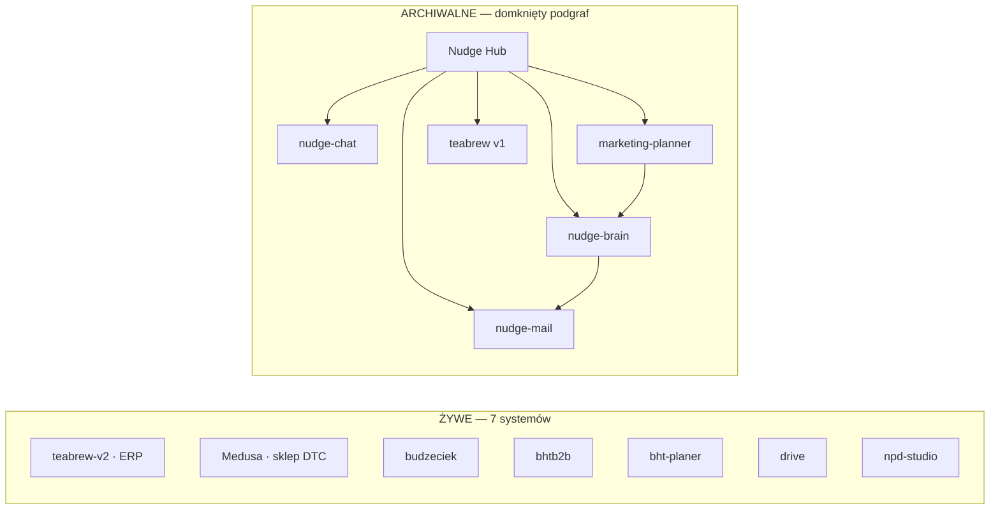
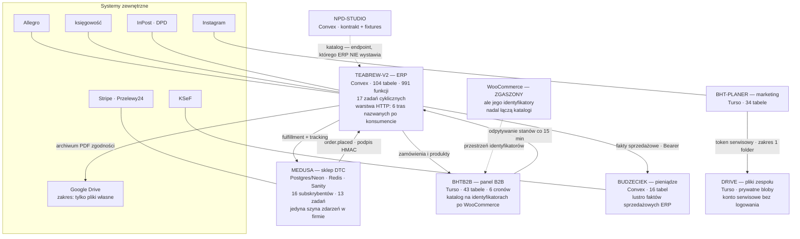
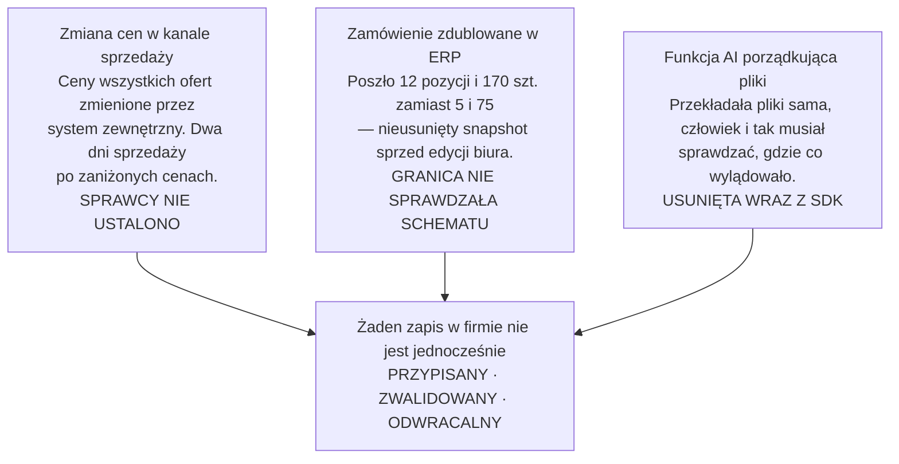
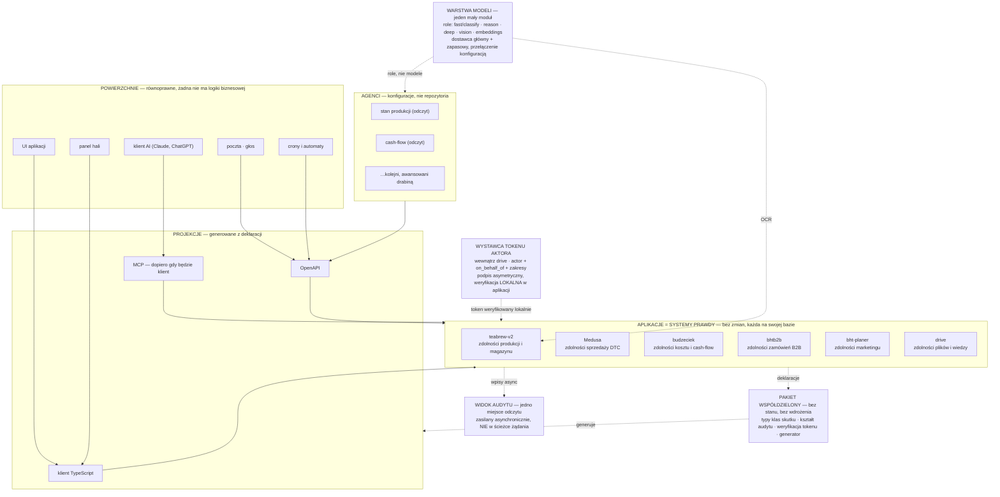

# Architektura BHT — stan faktyczny i kierunek na 3–5 lat

**Dokument architektoniczny · Brown House & Tea · 16.08.2026 · wersja 3**

> **Historia dokumentu.** Wersja 1 opierała architekturę na Nudge Hubie i na założeniu, że duże
> i niedawno dotykane repozytorium znaczy żywe. Wersja 2 obaliła to danymi o wdrożeniach.
> Wersja 3 (ta) domyka klasyfikację wszystkich 17 repozytoriów, rozstrzyga trzy pytania, które
> poprzednie wersje pozostawiły otwarte, i **istotnie upraszcza architekturę docelową** — poprzednia
> propozycja była przeskalowana dla firmy kilkunastoosobowej. Tabela weryfikacji tez z wersji 2
> jest w rozdziale 7.

> **Uwaga o zakresie tego pliku.** Repozytorium `nudge-chat` jest publiczne, dlatego tekst jest
> oczyszczony: bez nazw wdrożeń, identyfikatorów projektów, wartości i nazw sekretów oraz adresów
> produkcyjnych. Wnioski są kompletne; szczegóły techniczne pozostają w wersji prywatnej.

---

## 1. Executive summary

**Firma ma siedem żywych systemów, nie siedemnaście.** Dziesięć repozytoriów to archiwum,
eksperymenty albo rzeczy, które nigdy nie były aplikacją — w tym jedno puste repozytorium.
Cały klaster „Nudge" (Hub, Brain, Chat, Mail) plus starszy Marketing Planner i ERP v1 tworzą
domknięty podgraf: odwołują się wyłącznie do siebie, a żaden żywy system nie odwołuje się do nich.

**AI w żywych systemach praktycznie nie ma.** Trzy pliki w ERP robią OCR faktur, etykiet i ofert
przez jednego dostawcę. To wszystko. Cała warstwa AI firmy — 32 wywołania modelu, RAG, 13 narzędzi
agenta — leży w archiwum. Oznacza to, że nie stoimy przed refaktorem, tylko przed budową od zera
na dojrzałym majątku operacyjnym. To jest dobra wiadomość: warstwa modeli jest dziś tania,
bo do przeniesienia są trzy wywołania, nie trzydzieści sześć.

**Trzy incydenty z historii commitów mają jedną przyczynę.** Zmiana cen w kanale sprzedaży, której
sprawcy nie ustalono. Zamówienie, które poszło do ERP zdublowane, bo granica nie sprawdzała
schematu. Funkcja AI porządkująca pliki, usunięta, bo działała bez rozliczalności i człowiek
i tak musiał sprawdzać. Wspólny mianownik: **żaden zapis w tej firmie nie jest jednocześnie
przypisany, zwalidowany i odwracalny.** To, a nie brak modelu czy czatu, jest realną blokadą
przed wpuszczeniem AI do operacji.

**Rekomendacja jest lżejsza niż w wersji 2.** Nie budujemy bramy jako nowej usługi w ścieżce
żądania. Zdolności biznesowe wprowadzamy jako **konwencję wewnątrz istniejących aplikacji** plus
jeden mały pakiet współdzielony, z którego generujemy klienta TypeScript, OpenAPI i — dopiero gdy
będzie realny klient — MCP. Autoryzacja zostaje tam, gdzie już jest; dochodzi jedynie wspólny,
podpisany token aktora i wspólny kształt wpisu audytowego. Zero nowych usług w ścieżce krytycznej,
zero DevOps, zero przepisywania.

**Kolejność jest odwrotna do intuicyjnej.** Najpierw rozliczalność zapisów, potem agent na
odczytach, na końcu zapisy przez AI. Firma już raz odrzuciła AI, która pisała bez rozliczalności,
i miała rację. Każdy agent dołożony przed tą warstwą podzieli ten los.

**Trzy rzeczy rozstrzygnięte w tej wersji:**

| Pytanie | Odpowiedź z kodu |
|---|---|
| Który Marketing Planner? | **`bht-planer`.** 84 commity w 20 dni, aktywne wdrożenia, własne crony. `bht-marketing-planner` stoi od 30.04, zero commitów w 60 dni, jego jedyny konsument jest archiwalny |
| Google Drive czy własny Drive? | **Oba, w różnych rolach.** Prawdziwy Google Drive to archiwum dokumentów zgodności zapisywane automatycznie przez ERP. Własna aplikacja `drive` to przestrzeń plikowa zespołu. Ważne: obecny zakres OAuth pozwala ERP widzieć **tylko pliki, które sam utworzył** — agent nie przeczyta przez tę integrację dysku prowadzonego przez ludzi |
| Poczta? | **Wychodząca rozwiązana pięć razy w pięciu systemach. Przychodzącej nie ma w żadnym żywym systemie.** Czytanie skrzynki istniało tylko w archiwalnych Hubie i Mailu |

---

## 2. Inwentaryzacja repozytoriów

### Metoda

Data ostatniego commita kłamie w obie strony: automat commitujący backupy udaje życie, a stabilny
system produkcyjny bez zmian nadal obsługuje halę. Dlatego każde repozytorium oceniam czterema
sygnałami: **tempem** (commity w oknach 30/90/180 dni), **wdrożeniami** (czy wychodzą i czy się
udają), **zależnościami wejściowymi** (ile żywych systemów je woła) i **śladem operacyjnym**
(konfiguracja wdrożeń, crony, CI, kontrakty, testy).

Brak istotnych zmian przez 6–8 tygodni traktuję jako sygnał ostrzegawczy, nie wyrok. Dwa przypadki
pokazują, dlaczego:

- **TeaBrew v1** ma wdrożenia jeszcze z 17 czerwca — ale wszystkie z gałęzi backupowej, jako
  podglądy, nie produkcja. Produkcja stanęła 8 czerwca; potem automat dziewięć dni palił buildy.
- **`bhtb2b`** ma tylko 9 commitów w 30 dni, co wygląda na wygasanie — a to 9 wdrożeń
  produkcyjnych, wszystkie udane, każde naprawiające żywy przepływ pieniędzy. Mało commitów,
  wysoka stawka. **Klasyfikacja: produkcyjny i stabilny, nie wygaszany.**

### 2.1 Strategiczne i aktywnie rozwijane

| System | Tempo | Zależności wej. | Infrastruktura | Rola |
|---|---|---|---|---|
| **teabrew-v2** — ERP | 178 commitów / 14 dni | **4** | Convex + Vercel, 17 zadań cyklicznych | Partie, magazyn, produkcja, HACCP, GS1, wysyłki, kanały sprzedaży. 290 tys. LOC, 104 tabele, 991 funkcji. **Centrum grafu zależności** |
| **bht-next-prototype** — sklep DTC | 164 commity / 26 dni | 2 | Render (Frankfurt) + Postgres na Neon + Redis + Sanity, Stripe, Przelewy24 | Monorepo Medusa v2: backend, storefront, studio, admin. 96 tys. LOC, 16 subskrybentów zdarzeń, 13 zadań cyklicznych, 5 własnych modułów. **Serwuje sklep pod główną domeną** |
| **budzeciek** — pieniądze | 190 commitów / 9 dni | 1 | Convex + Vercel, 2 zadania cykliczne | Koszt kanoniczny, cash-flow, KSeF, transakcje bankowe. 32 tys. LOC, 16 tabel |
| **bht-planer** — Marketing Planner | 84 commity / 20 dni (start 27.07) | 0 | Vercel + Turso, 2 crony | Kalendarz treści, media, Instagram, inspiracje, zadania, KPI kampanii. 23 tys. LOC, 34 tabele. **To jest „ten" Marketing Planner** |

> Sklepu nie było na liście od właściciela, ale dowody są jednoznaczne: to najaktywniejsze
> repozytorium po ERP i budżeciku, serwuje sprzedaż pod główną domeną, ERP i panel B2B od niego
> zależą. Traktuję jako strategiczny.

### 2.2 Produkcyjne i używane, ale stabilne

| System | Tempo | Zależności wej. | Infrastruktura | Charakter |
|---|---|---|---|---|
| **bhtb2b** — panel B2B | 9 commitów / 30 dni, **9 udanych wdrożeń produkcyjnych** | 2 | Vercel + Turso, **6 cronów** | Zamówienia, rabaty per klient, CRM, kupony, czat obsługi, zgłoszenia, prospekting. 38 tys. LOC, 43 tabele. Ostatnie zmiany to naprawy przepływu do ERP i księgowości: zaokrąglenia do grosza, dublujące się pozycje, odcięcie martwego WooCommerce |

### 2.3 Pomocnicze / infrastrukturalne

| System | Tempo | Zależności wej. | Rola |
|---|---|---|---|
| **drive** — przestrzeń plikowa zespołu | 17 commitów / 30 dni, **20 udanych wdrożeń / 90 dni** | 1 (planer) | Dysk firmowy z działami jako granicą widoczności, wersje plików, kosz z retencją, udostępnienia imienne, baza wiedzy. 11 tys. LOC, prywatny magazyn blobów. **Najlepiej zabezpieczona aplikacja w firmie** |

### 2.4 Eksperymentalne

| System | Tempo | Zależności wej. | Dlaczego jest ważny nieproporcjonalnie do rozmiaru |
|---|---|---|---|
| **npd-studio** — rozwój nowych produktów | 6 commitów w 1 dniu (07.08) | 0 | 4,3 tys. LOC, 13 tabel, dostęp zamknięty listą adresów (na starcie jedna osoba). **Ma jedyny w firmie pisany, wersjonowany kontrakt integracyjny**: 9 fixture'ów wraz z przypadkami negatywnymi, manifest z sumą kontrolną zestawu, osobny token per aplikacja, testy kontraktu w CI |

### 2.5 Nieaktywne / archiwalne

| System | Ostatnie życie | Dowód | LOC |
|---|---|---|---|
| **teabrew** — ERP v1 | produkcja 08.06 | Zastąpiony przez v2. Po 8 czerwca tylko automat backupów. Zero żywych konsumentów. 92 route'y, 4 workflowy CI — był porządnie zrobiony | 137 tys. |
| **teabrew-calendar** — Nudge Hub | 28.07 | **Ostatnie wdrożenie produkcyjne zakończyło się błędem i nikt go nie naprawił.** 166 commitów w 180 dni, z tego 1 w ostatnich 90. Zero żywych konsumentów. 155 route'ów, 65 tabel, **32 wywołania modelu** | 73 tys. |
| **bht-marketing-planner** | 30.04 | Zero commitów w 60 dni. Jedyny konsument (Hub) archiwalny. Funkcję planowania przejął `bht-planer`. Ma integracje, których `bht-planer` nie ma: Meta Ads, Mailchimp, GetResponse | 25 tys. |
| **nudge-brain** | 28.04 | **Zero wdrożeń w ostatnich 90 dniach.** Baza wiedzy z RAG i embeddingami. Konsumenci: Hub i marketing-planner, oba archiwalne | 18 tys. |
| **nudge-mail** | 20.04 | Zero commitów. Jedyne miejsce w firmie, które **czytało** skrzynkę pocztową | 13 tys. |
| **nudge-chat** | 23.05 | Zero commitów w 30 dni. Czat w panelu B2B to osobna implementacja, nie ten system | 8 tys. |
| **b2b-brownhouse** | 09.03 | Pierwotny portal B2B w PHP. Zastąpiony przez `bhtb2b` | — |
| **b2b-brownhousebest** | 09.03 | Porzucone przepisywanie tego samego portalu: manifest paczki bez ani jednej zależności, w zamian pięć plików z raportami o ukończeniu | — |
| **Teablender** | 14.03 | Nie jest aplikacją — brak manifestu paczki, w środku konfiguracja i szablony. Jeden commit: „Add files via upload" | — |
| **CalendarPWA** | — | **Puste repozytorium. Zero commitów.** | 0 |

### 2.6 Klaster Nudge jest domknięty



**Zero krawędzi z prawej do lewej.** Klaster można odłączyć w jednym ruchu — nic żywego nie
przestanie działać. Zastrzeżenie: to dowód, że nikt tych systemów nie **rozwija**. Czy ktoś ich
jeszcze **używa**, rozstrzygną liczniki baz i logi (pozycja 1 roadmapy).

---

## 3. Faktyczny system produkcyjny

Siedem aplikacji, pięć krawędzi integracyjnych, **57 elementów autonomicznej maszynerii**
w czterech różnych systemach harmonogramowania:

| Rodzaj | Gdzie | Ile |
|---|---|---|
| Zadania cykliczne Convex | teabrew-v2 | 17 |
| Zadania cykliczne Convex | budzeciek | 2 |
| Zadania cykliczne Medusa | sklep | 13 |
| Subskrybenci zdarzeń Medusa | sklep | 16 |
| Crony Vercel | bhtb2b | 6 |
| Crony Vercel | bht-planer | 2 |
| Crony Vercel | drive | 1 |

Nie ma jednego miejsca, w którym widać, co się kiedy uruchamia. To nie jest pilne, ale będzie
pierwszym pytaniem przy każdym incydencie.

### Domeny i systemy prawdy

| Domena | System prawdy | Baza | Kto jeszcze trzyma kopię |
|---|---|---|---|
| Materiały, partie, produkcja, magazyn | **teabrew-v2** | Convex | — |
| Zgodność: HACCP, atesty, specyfikacje | **teabrew-v2**, archiwum PDF na Google Drive | Convex + Drive Google | — |
| Sprzedaż DTC, klienci detaliczni, subskrypcje | **Medusa** | Postgres (Neon) | ERP trzyma migawkę zamówień |
| Katalog i treść sklepu | **Medusa + Sanity** | Postgres + Sanity | ERP trzyma mapowania produktów |
| Zamówienia B2B, rabaty per klient, CRM | **bhtb2b** | Turso | ERP trzyma migawkę produktów B2B |
| Koszt kanoniczny, cash-flow, KSeF | **budzeciek** | Convex | — |
| Faktury i księgi | **zewnętrzny system księgowy** | poza nami | ERP trzyma migawkę sprzedaży |
| Plan treści, media, kampanie, KPI marketingu | **bht-planer** | Turso | — |
| Pliki zespołu, baza wiedzy | **drive** | Turso + prywatne blobY | planer korzysta przez token serwisowy |
| Rozwój nowych produktów | **npd-studio** | Convex | lustro katalogu ERP |
| Kanały zewnętrzne (Allegro, Woo) | poza nami | — | ERP trzyma migawki ofert i zamówień |

**Duplikacja prawdy, która wymaga uwagi:** `budzeciek` trzyma lustro faktów sprzedażowych z ERP,
a ERP trzyma migawki czterech systemów zewnętrznych, w tym **migawkę zamówień z wygaszonego
WooCommerce**. Migawka systemu zewnętrznego to wzorzec sensowny. Lustro własnego systemu — nie.

---

## 4. Diagram obecnej architektury



**Pięć krawędzi, cztery różne modele zaufania:**

| Krawędź | Mechanizm | Ocena |
|---|---|---|
| Sklep → ERP | **Podpis HMAC-SHA256 na treści**, retry z narastającym odstępem, jawny tryb awarii | Jedyna krawędź zrobiona porządnie. **Wzorzec do skopiowania** |
| Panel B2B ↔ ERP | **Jeden statyczny sekret w obu kierunkach** | Wyciek otwiera i odczyt stanów, i zapis zamówień |
| ERP → Budżeciek | Bearer, osobny token per konsument, porównanie czasowo stałe | Akceptowalne, brak podpisu treści i rotacji |
| Planer → Drive | Token serwisowy, zakres jednego folderu, konto bez możliwości logowania | **Najlepszy model tożsamości maszynowej w firmie** |
| NPD → ERP | Osobny token, wersjonowany kontrakt, fixture'y | Kontrakt wzorowy, ale **zadeklarowany jednostronnie** |

---

## 5. Przepływy danych

**Zamówienie detaliczne.** Klient płaci w sklepie → subskrybent `order.placed` wysyła podpisane
żądanie do ERP → ERP tworzy zlecenie sprzedaży i autoplan produkcji → po wysyłce ERP wypycha
fulfillment z numerem przesyłki z powrotem do sklepu. Przelew tradycyjny tworzy zamówienie
nieopłacone, które czeka poza kolejką hali; potwierdzenie przelewu wysyła ten sam ładunek ze
statusem opłacone i zwalnia je do produkcji. Ta sama para zdarzeń bramkuje etykietę kurierską.
**To jest najlepiej zaprojektowany przepływ w firmie.**

**Zamówienie B2B.** Klient składa zamówienie w panelu → biuro może je edytować → po zatwierdzeniu
idzie do ERP. Stany magazynowe płyną w drugą stronę: panel **odpytuje ERP co 15 minut**, czyli
96 razy na dobę, o dane, które zmieniają się na zdarzeniach produkcyjnych. Ta sama informacja
w sklepie jest przekazywana zdarzeniem.

**Koszt i cash-flow.** Budżeciek pobiera fakty sprzedażowe z ERP i materializuje je u siebie.
Kod tej integracji ma **2 891 linii** — to nie adapter synchronizacji, to druga implementacja
semantyki sprzedaży i kosztu, mieszkająca w warstwie integracyjnej.

**Zgodność.** Zakończenie mieszania tworzy kartę HACCP → harmonogram Convex konwertuje ją do PDF
przez Google Docs i zapisuje w strukturze Rok/Miesiąc na firmowym Google Drive. Sześć modułów ERP
wywołuje ten mechanizm.

**Marketing.** Planer trzyma plan i media u siebie, pliki odkłada w firmowym dysku przez token
serwisowy zamiast utrzymywać drugi magazyn. Metryki z Instagrama ciągnie sam.

---

## 6. Problemy i ryzyka

### 6.1 Trzy incydenty, jedna przyczyna



Audyt po incydencie cenowym wykazał zero ścieżek zapisu we własnym kodzie i dodał twardy blok na
metody zapisu — ale źródła zmiany nie udało się wskazać. To najdroższy z trzech i najlepiej
pokazuje, czego brakuje.

**Usunięcie funkcji AI z dysku to najważniejsze ustalenie całego audytu.** To nie porażka modelu,
to porażka obudowy. Uzasadnienie w commicie jest precyzyjne: funkcja przekładała pliki po swojemu,
a człowiek i tak musiał potem sprawdzić, gdzie co wylądowało. Dokładnie to samo powtórzy się
z każdym agentem dołożonym do ERP, budżetu czy sklepu, dopóki nie powstanie warstwa, która zapis
przypisuje, waliduje i pozwala cofnąć.

### 6.2 Pozostałe ryzyka

| Ryzyko | Praw. | Skutek | Środek |
|---|---|---|---|
| **Wygaszenie klastra Nudge wyłącza coś, czego ktoś jednak używa** — mam dowód na brak rozwoju, nie na brak ruchu | średnie | wysoki | Kolejność: 30 dni liczników i logów, potem odcięcie sekretów, na końcu archiwizacja. Nie odwrotnie |
| **Wspólny sekret w obu kierunkach** między panelem B2B a ERP | średnie | krytyczny | Rozdzielić na dwa kierunkowe z podpisem treści. Zadanie na teraz, przed pracą nad AI |
| **2 891 linii logiki biznesowej w warstwie integracyjnej** (lustro sprzedaży) | wysokie | wysoki | Nie przepisywać. Otoczyć testami kontraktowymi na fixture'ach i przestać rozbudowywać; nowa logika kosztu tylko po jednej stronie |
| **Katalog spięty identyfikatorami wygaszonego sklepu** | wysokie | wysoki | Jawne mapowanie SKU z testem spójności. Rozjazd zdarzył się już raz przy migracji i wymagał ręcznego dociągania stanów i zdjęć |
| **Odpytywanie ERP co 15 minut** zamiast zdarzenia | wysokie | średni | Wzorzec zdarzeniowy już działa na krawędzi sklep→ERP. Przenieść stany B2B na ten sam mechanizm |
| **26 różnych sekretów i tokenów** bez rotacji i bez jednego spisu | wysokie | wysoki | Spis właścicieli i dat rotacji. Docelowo podpis zamiast tokenu współdzielonego |
| **57 elementów maszynerii w 4 systemach harmonogramowania**, bez jednego widoku | wysokie | średni | Jedna strona z rejestrem: co, gdzie, jak często, kto właścicielem |
| **Kontrakty jednostronne** — konsument wyprzedził dostawcę o miesiąc | wysokie | średni | Fixture'y uruchamiane w CI **po obu stronach**. Kontrakt bez testu dostawcy to notatka, nie kontrakt |
| **Tempo 190 commitów w 9 dni bez rozdziału środowisk** na systemach strategicznych | wysokie | wysoki | Rozszerzyć dyscyplinę wdrożeniową z ERP na budżeciek i sklep |
| **Migawka zamówień z wygaszonego sklepu** wciąż w schemacie ERP | niskie | niski | Usunąć przy najbliższym porządkowaniu schematu |
| **Sześć systemów uwierzytelniania** dla kilkunastu osób | wysokie | średni | **Nie konsolidować teraz.** Koszt przewyższa zysk przy tej liczbie osób. Rozwiązać dopiero, gdy agenci będą potrzebować delegowanych uprawnień (rozdział 12) |
| **Zero AI w żywych systemach = zero doświadczenia operacyjnego** | — | średni | Pierwszy agent tylko na odczytach, w jednej domenie, z budżetem |

---

## 7. Weryfikacja tez z poprzedniej wersji

| Teza z wersji 2 | Status | Uzasadnienie |
|---|---|---|
| 7 systemów żywych, 10 do zamknięcia | **nadal aktualna** | Potwierdzona pełną klasyfikacją pięciostopniową |
| W żywym majątku AI praktycznie nie ma (3 akcje OCR) | **nadal aktualna, wzmocniona** | Pełny przegląd 17 repozytoriów: w żywych systemach **jeden dostawca, dwa modele, trzy pliki**. Zero Anthropic. Cała reszta w archiwum |
| Centrum grafu to ERP, nie Nudge Hub | **nadal aktualna** | 4 zależności wejściowe wobec zera u Huba |
| W żywym majątku nie ma współdzielonych baz | **nadal aktualna** | Trzy osobne bazy Turso, dwa osobne wdrożenia Convex, Postgres osobno. Zero odczytów z cudzej bazy |
| Kontrakt istnieje w `npd-studio`, ale jednostronnie | **nadal aktualna** | ERP nie ma ani jednego odwołania do NPD i nie wystawia umówionej trasy |
| Trzy incydenty, jedna przyczyna | **nadal aktualna** | Rdzeń diagnozy |
| Sklep stoi na Render + Neon, nie Railway | **nadal aktualna** | Potwierdzone w konfiguracji wdrożenia |
| **Brama firmowa jako nowa jednostka wdrożenia w ścieżce żądania** | **BŁĘDNA — wycofana** | Przeskalowane dla kilkunastu osób. Wprowadza nowy pojedynczy punkt awarii w ścieżce krytycznej i nowy DevOps, żeby rozwiązać problem, który da się rozwiązać podpisanym tokenem i konwencją. Zamiennik w rozdziale 9 |
| MCP jako jedna z trzech generowanych projekcji od początku | **częściowo aktualna** | Kierunek dobry, kolejność zła. MCP dopiero gdy będzie realny klient; start od typowanego HTTP, który już w połowie istnieje |
| Rejestr promptów i zbiory evaluacyjne w pierwszej fazie | **częściowo aktualna** | Przy trzech promptach to overengineering. Wersja minimalna: jeden plik z promptami, stała wersji, trzy fixture'y wzorcowe. Rejestr przy piątym promptcie |
| Szyna zdarzeń rozciągnięta na resztę firmy | **częściowo aktualna** | Nie budować szyny firmowej. Zastąpić jedno konkretne odpytywanie (stany B2B) wzorcem zdarzeniowym, który już działa |
| Wspólna baza Hub↔Chat jako najgorsze sprzężenie | **nieistotna** | Dotyczy dwóch systemów archiwalnych |
| Produkcyjny ERP na deweloperskim wdrożeniu | **nieistotna w tym dokumencie** | Ryzyko realne, ale to szczegół infrastrukturalny wyłączony z wersji publicznej |
| 40 mutacji jednorazowych napraw w powierzchni produkcyjnej | **nadal aktualna** | Nie mogą wejść do katalogu zdolności |
| Rekomendacja: uogólnić kontrakt z `npd-studio` | **nadal aktualna, teraz rdzeń propozycji** | Najtańsza droga do rozliczalności: wzorzec jest wewnętrzny, przetestowany, zrozumiały dla zespołu |

---

## 8. Elementy starego kodu warte ponownego wykorzystania

Klastra Nudge nie reanimujemy, ale są w nim wzorce, które oszczędzą tygodnie pracy. Wartość jest
w **pomysłach**, nie w kodzie do podłączenia.

| Co | Gdzie | Dlaczego warto |
|---|---|---|
| **Pętla narzędziowa agenta z 13 narzędziami** | Nudge Hub, ~700 linii | Gotowy wzorzec: definicje schematów wejścia, wykonanie narzędzia, pętla wyników, heurystyka wykrywania „model twierdzi, że zrobił, a nie zrobił". Przy pierwszym agencie skopiować strukturę |
| **Pamięć reguł wstrzykiwana do promptu** | Nudge Hub | Reguła zapisana przez użytkownika („zawsze traktuj X jako priorytet") trafia do promptu systemowego wszystkich przyszłych rozmów. Właściwy prymityw personalizacji agenta |
| **Skaner rozmów z progiem wyciszenia** | Nudge Hub | Grupuje wiadomości w bloki, czeka aż rozmowa osiądzie, daje modelowi pełny kontekst i pozwala mu jawnie zdecydować „zakończona → wyciągnij zadanie" vs „jeszcze dyskutują → pomiń". Bezpośrednio przenośne na skanowanie poczty |
| **Telemetria kosztu AI per funkcja i osoba** | Nudge Hub | Tabela zużycia z rozbiciem na tokeny wejścia, wyjścia i cache. Skopiować przy pierwszym wywołaniu przez nową warstwę |
| **RAG z embeddingami nad bazą wiedzy** | nudge-brain | Wzorzec chunkowania i wyszukiwania. Uwaga: implementacja trzyma wektory jako blobY i liczy podobieństwo w aplikacji — do przemyślenia, nie do skopiowania wprost |
| **Czytanie skrzynki pocztowej** | nudge-mail | **Jedyny kod w firmie, który czytał pocztę przychodzącą.** Przy podłączaniu poczty (rozdział 14) to punkt startowy, nie zielone pole |
| **Integracje marketingowe** | bht-marketing-planner | Meta Ads, Mailchimp, GetResponse — `bht-planer` ich nie ma. Jeśli będą potrzebne, tu jest działający kod |
| **Twardy blok na metody zapisu** | ERP, po incydencie cenowym | To już jest klasa skutku wymuszona w kodzie, tylko ręcznie i w jednym miejscu. Wzorzec do uogólnienia |
| **Model tożsamości maszynowej** | drive | Konto serwisowe bez możliwości logowania, token o zakresie jednego folderu, porównanie czasowo stałe, 404 zamiast 403 by nie zdradzać istnienia. **To jest gotowy model poświadczeń dla agenta** |
| **Kontrakt z fixture'ami** | npd-studio | Rdzeń propozycji z rozdziału 9 |
| **Podpis HMAC na treści** | subskrybent sklep→ERP | Wzorzec dla pozostałych krawędzi |

---

## 9. Proponowana architektura docelowa

### 9.1 Ocena krytyczna koncepcji „capabilities"

Koncepcja jest **słuszna co do treści i była przeskalowana co do formy.** Rozdzielam te dwie rzeczy.

**Co jest słuszne.** Operacja biznesowa opisana raz, z jawnym schematem wejścia i wyjścia,
uprawnieniami, klasą skutku, wpisem audytowym i możliwością cofnięcia — to dokładnie odpowiedź na
trzy incydenty z rozdziału 6. I odpowiedź na wymóg „jedna funkcja dostępna dla człowieka i dla
AI": jeśli generujemy klienta i narzędzie z jednej definicji, nie da się zrobić funkcji tylko dla
jednej publiczności.

**Co było przeskalowane.** Wersja 2 proponowała bramę jako osobną usługę w ścieżce każdego żądania,
rejestr jako osobny komponent, trzy projekcje od pierwszego dnia i firmową szynę zdarzeń.
Dla firmy kilkunastoosobowej to:

- nowy pojedynczy punkt awarii przed wszystkimi aplikacjami,
- nowy element do utrzymania, monitorowania i skalowania,
- opóźnienie w każdym wywołaniu,
- praca, która nie odpowiada na żaden problem z najbliższych 12 miesięcy.

Autoryzacja **już działa** w każdej aplikacji. Problemem nie jest brak miejsca, gdzie sprawdzać
uprawnienia — problemem jest brak **wspólnego formatu** tożsamości i audytu.

### 9.2 Propozycja: zdolności jako konwencja, nie usługa

Trzy elementy. Żaden nie jest nową usługą w ścieżce krytycznej.

**A. Konwencja zdolności wewnątrz aplikacji.** Zdolność to eksportowana funkcja w aplikacji, która
jest systemem prawdy dla swojej domeny — funkcja Convex w ERP, trasa w panelu B2B, workflow
w sklepie. Opakowana deklaracją:

```
nazwa domenowa       create_purchase_order
schemat wejścia      zod
schemat wyjścia      zod
zakresy              purchase:write
klasa skutku         zapis_nieodwracalny
audyt                szablon wpisu
cofnięcie            uchwyt lub null
wersja               v1 + fixture'y
```

Cztery klasy skutku, bo one decydują o polityce: **odczyt** (wolny w ramach zakresu), **zapis
odwracalny** (wolny, w audycie, z uchwytem cofnięcia), **zapis nieodwracalny** (wymaga
zatwierdzenia), **działanie zewnętrzne** — wysłanie maila, zmiana ceny w kanale, wystawienie
dokumentu (zatwierdzenie + podpis + atrybucja zawsze). Incydent cenowy to dokładnie ta czwarta
klasa, obsłużona dziś ręcznym blokiem w jednym pliku.

**B. Jeden mały pakiet współdzielony** — typy klas skutku i zakresów, kształt wpisu audytowego,
weryfikacja tokenu aktora, generator. Rzędu kilkuset linii, bez stanu, bez wdrożenia. Z deklaracji
generuje:

1. **klienta TypeScript** — używa go UI aplikacji, tak samo jak agent,
2. **OpenAPI** — dla wywołań międzysystemowych i function callingu dowolnego dostawcy,
3. **serwer MCP** — jedna trasa w istniejącej aplikacji, generowana, **dopiero gdy będzie realny klient**.

**C. Wspólny format tożsamości i audytu, bez wspólnej usługi.** Token aktora podpisany kluczem
asymetrycznym, niosący `actor`, `on_behalf_of` i zakresy. Wystawia go jeden wystawca — mieszka
wewnątrz aplikacji, która ma już porządny katalog osób (`drive`). Każda aplikacja **weryfikuje
podpis lokalnie**: brak wywołania sieciowego w ścieżce, brak pojedynczego punktu awarii, brak
nowej usługi. Wpisy audytowe każda aplikacja zapisuje u siebie i **asynchronicznie** wysyła kopię
do jednego widoku odczytowego, żeby pytanie „kto zmienił tę cenę" miało jedno miejsce odpowiedzi.

### 9.3 Kiedy dopiero wprowadzić prawdziwą bramę

Nie teraz. Warunki, które to uzasadnią — spisane, żeby decyzja była mechaniczna:

- więcej niż ~5 agentów pisujących w ≥3 domenach,
- klienci zewnętrzni poza kontrolą firmy,
- potrzeba natychmiastowego unieważnienia uprawnień w jednym miejscu,
- limity, których nie da się wymusić po stronie aplikacji.

Do tego czasu podpisany token i konwencja dają to samo bez usługi.

---

## 10. Diagram architektury docelowej



Różnica wobec wersji 2: **nie ma pudełka w poprzek ścieżki żądania.** Pakiet współdzielony jest
biblioteką, wystawca tokenu jest wywoływany raz na sesję, widok audytu jest zasilany
asynchronicznie. Awaria któregokolwiek z nich nie zatrzymuje sprzedaży.

---

## 11. Rola capabilities, API, MCP i zdarzeń

| Warstwa | Rola | Kiedy wprowadzić |
|---|---|---|
| **Zdolności** | Źródło prawdy o tym, co firma umie zrobić i kto może. Deklaracja obok kodu domenowego | **Teraz**, po jednej domenie |
| **Klient TypeScript** | Sposób, w jaki UI aplikacji wywołuje własne zdolności. Gwarantuje, że nie powstanie funkcja tylko dla człowieka | Razem ze zdolnościami |
| **HTTP + OpenAPI** | Wywołania międzysystemowe i function calling dowolnego dostawcy. Naturalne rozwinięcie warstwy HTTP, którą ERP już ma | **Faza 30 dni** |
| **MCP** | Projekcja dla klientów rodziny Claude i podobnych. Generowana, wymienialna | **Gdy pojawi się realny klient**, nie wcześniej |
| **Zdarzenia** | Propagacja zmian między systemami. Wzorzec już działa na krawędzi sklep→ERP | Punktowo: zastąpić odpytywanie stanów B2B |

### Porównanie opcji

| Opcja | Za | Przeciw | Rekomendacja |
|---|---|---|---|
| **MCP jako fundament** | Jedna powierzchnia, klienci zewnętrzni bez pracy, rozpęd ekosystemu | To protokół klient–narzędzia. **Nie jest systemem autoryzacji, walidacji, audytu ani polityk.** Gdyby powstał pierwszy i trzymał poświadczenia, dostalibyśmy sześć niezależnych pojęć uprawnień — dzisiejsze rozdrobnienie o warstwę wyżej | **Nie jako fundament.** Jako generowana projekcja |
| **HTTP/OpenAPI + function calling** | Nudne, diagnozowalne, wersjonowalne, działa z każdym dostawcą, połowa już istnieje | Każdy runtime potrzebuje adaptera, brak odkrywalności | **Punkt startowy** |
| **Bezpośrednie SDK w aplikacjach** | Zero warstw, najszybciej | Każda aplikacja wiąże się z dostawcą; podmiana modelu to zmiana w N repozytoriach. Dokładnie ten dług, który archiwum już ma | Nie |
| **Architektura zdarzeniowa jako całość** | Luźne sprzężenie, naturalna propagacja | Sklep ma szynę, reszta nie. Budowa firmowej szyny to nowa infrastruktura dla problemu, który dziś ma jedną instancję | **Punktowo**, nie jako paradygmat |
| **Hybryda: zdolności + OpenAPI teraz, MCP i zdarzenia punktowo** | Odpowiada na realne problemy, zero nowych usług, wykorzystuje istniejący kod i wzorce | Wymaga dyscypliny w przeglądzie wydań | **To rekomendacja** |

---

## 12. Model tożsamości, uprawnień i audytu

Gdzie co mieszka — i dlaczego nie w nowej usłudze:

| Element | Gdzie | Uzasadnienie |
|---|---|---|
| **Tożsamość użytkownika** | Tam gdzie dziś, plus jeden wystawca tokenu aktora wewnątrz `drive` | Sześć systemów uwierzytelniania dla kilkunastu osób to nieelegancko, ale konsolidacja jest droga i ryzykowna. Wystawca daje wspólny format bez migracji logowań |
| **Tożsamość agenta** | Własne poświadczenie per agent, wzorem konta serwisowego z `drive` | Model już działa: konto bez możliwości logowania, zakres wąski, porównanie czasowo stałe. Skopiować, nie projektować |
| **Delegowanie uprawnień** | W tokenie: `actor` = agent, `on_behalf_of` = człowiek, `scopes` = przecięcie uprawnień obu | Agent nigdy nie ma więcej niż osoba, w której imieniu działa. To odpowiedź na „agent musiałby dostać pełne prawa albo żadne" |
| **Autoryzacja** | **Lokalnie w aplikacji**, która jest systemem prawdy | Aplikacja i tak zna swoje dane i swoje reguły. Wyniesienie tego na zewnątrz oznacza duplikat wiedzy domenowej w bramie |
| **Klasy skutku i zatwierdzanie** | Deklaracja zdolności + lokalne wymuszenie | Nieodwracalne i zewnętrzne wymagają tokenu zatwierdzenia. Zatwierdza człowiek z odpowiednim zakresem |
| **Audyt** | Zapis lokalny, **kopia asynchroniczna** do jednego widoku odczytowego | Jedno miejsce na pytanie „kto to zrobił", zero ryzyka, że awaria audytu zatrzyma sprzedaż |
| **Limity** | Po stronie aplikacji i po stronie warstwy modeli (budżet tokenów per agent) | Przy tej skali wystarcza. Limity centralne dopiero z bramą |
| **Cofanie** | Uchwyt w deklaracji zdolności, implementacja w aplikacji | Tylko aplikacja wie, jak odwrócić swoją operację |

**Czego świadomie nie robimy teraz:** jednego logowania dla wszystkich aplikacji. To kilka tygodni
pracy i ryzyko zablokowania ludziom dostępu, żeby rozwiązać problem, który przy kilkunastu osobach
boli mało. Wraca do rozmowy, gdy agenci będą pisać w wielu domenach.

---

## 13. Warstwa AI

### 13.1 Stan faktyczny

Pełny przegląd 17 repozytoriów:

| Gdzie | Wywołania | Uwaga |
|---|---|---|
| **teabrew-v2 (żywy)** | **3 pliki** — OCR faktur, etykiet i ofert | Jeden dostawca, dwa modele, wywołania bezpośrednio z kodu |
| Nudge Hub (archiwum) | 32 | — |
| nudge-brain (archiwum) | 13 + embeddingi | — |
| ERP v1 (archiwum) | 9 | — |
| marketing-planner (archiwum) | 12 plików przez SDK | — |
| pozostałe żywe systemy | **0** | sklep, budżeciek, panel B2B, planer, dysk, NPD |

W żywym majątku: **jeden dostawca, dwa identyfikatory modeli, trzy pliki.** To jest cała warstwa AI
firmy dzisiaj.

### 13.2 Propozycja — minimalna, bo problem jest dziś mały

Jeden mały moduł współdzielony. **Nie platforma.**

**Role zamiast identyfikatorów modeli.** Kod nazywa rolę, nie model:

| Rola | Do czego | Dziś |
|---|---|---|
| `fast/classify` | Masowa klasyfikacja, tanie decyzje | nieużywane |
| `reason` | Domyślna praca agenta | nieużywane |
| `deep` | Trudne planowanie | nieużywane |
| `vision` | OCR faktur, etykiet, ofert | **3 wywołania — jedyne dziś** |
| `embeddings` | Wyszukiwanie po znaczeniu | nieużywane, potrzebne przy wiedzy i poczcie |

Mapowanie rola → dostawca i model w konfiguracji per środowisko, zmienialnej bez wdrożenia.
Podmiana modelu przestaje być zmianą kodu.

**Co robić teraz, a co odłożyć:**

| Element | Decyzja | Dlaczego |
|---|---|---|
| Wspólna warstwa AI (role, konfiguracja, retry, timeout) | **Teraz** | Trzy wywołania do przeniesienia. Przy piątej funkcji AI będzie już drogo |
| Fallback między dostawcami | **Teraz, dla `vision`** | Awaria OCR faktur blokuje księgowanie. To jedyne AI na ścieżce operacyjnej |
| Monitorowanie kosztów | **Teraz**, jedna tabela | Wzorzec do skopiowania z archiwum. Tanie, a bez tego agenci są nieprzewidywalni budżetowo |
| Rejestr promptów | **Odłożyć** | Przy trzech promptach to overengineering. Wersja minimalna: jeden plik, stała wersji, trzy fixture'y wzorcowe. Rejestr przy piątym promptcie |
| Zbiory evaluacyjne | **Minimalnie teraz** | Trzy fixture'y na OCR, bo to jedyna funkcja z konsekwencją finansową. Rozbudowa razem z liczbą promptów |
| Trace'owanie działań agenta | **Razem z pierwszym agentem** | Bez agenta nie ma czego trace'ować. Wpis audytowy zdolności już to w dużej mierze daje |
| Własny model, dostrajanie | **Nie** | Brak przypadku użycia i brak danych w skali, która by to uzasadniła |

---

## 14. Integracja poczty i dokumentów

### 14.1 Stan faktyczny

**Poczta wychodząca jest rozwiązana pięć razy.** Sklep (29 plików — transakcyjna i marketingowa:
porzucony koszyk, powitania, odzyskiwanie, urodziny, przypomnienia o punktach, powiadomienia
o dostępności), panel B2B (automatyzacja prospektów, maile do zamówień), ERP (zamówienia do
dostawców), planer (przypomnienia), dysk (powiadomienia o udostępnieniu).

**Poczty przychodzącej nie ma w żadnym żywym systemie.** Czytanie skrzynki istniało wyłącznie
w archiwalnych Hubie i Mailu. To znaczy, że zapytania klientów, zamówienia mailem, faktury
i decyzje z korespondencji **nie są dziś dotykane przez żaden kod, który utrzymujemy**.

**Dokumenty rozdzielają się na dwa światy:**

| Świat | Co tam jest | Kto zapisuje | Ograniczenie |
|---|---|---|---|
| **Firmowy Google Drive** | Archiwum PDF dokumentów zgodności: karty HACCP, karty dostaw, atesty, specyfikacje, protokoły | ERP automatycznie, po zdarzeniach produkcyjnych | **Zakres OAuth pozwala widzieć tylko pliki, które aplikacja sama utworzyła.** Agent nie przeczyta przez tę integrację dysku prowadzonego przez ludzi |
| **Własna aplikacja `drive`** | Pliki zespołu, podział na działy jako granica widoczności, wersje, udostępnienia, baza wiedzy | Ludzie + planer przez token serwisowy | Brak indeksowania treści plików |

To ograniczenie zakresu jest architektonicznie istotne i łatwo je przeoczyć: „podłączmy agenta do
Google Drive" znaczy dwie zupełnie różne prace, zależnie od tego, o który dysk chodzi.

### 14.2 Propozycja

Poczta i dokumenty wchodzą **jako zdolności, nie jako osobny system** — dokładnie w tych samych
ramach uprawnień i audytu co reszta.

| Krok | Co | Kiedy |
|---|---|---|
| 1 | **Zdolności odczytu dokumentów** w `drive`: szukaj, pobierz metadane, pobierz treść — z zakresami i widocznością działową, którą aplikacja już wymusza | Faza 3 miesiące |
| 2 | **Indeksowanie treści plików** w `drive` (dziś szuka tylko po nazwach) + rola `embeddings` | Faza 3 miesiące |
| 3 | **Poczta przychodząca jako zdolność odczytu**: lista, wątek, załączniki. Punkt startowy to kod czytający skrzynkę z archiwalnego `nudge-mail`, nie zielone pole | Faza 12 miesięcy |
| 4 | **Klasyfikacja i kierowanie poczty** rolą `fast/classify`, wzorcem skanera rozmów z archiwum: czekaj aż wątek osiądzie, daj modelowi pełny kontekst, pozwól jawnie zdecydować | Faza 12 miesięcy |
| 5 | **Zapis do poczty i dokumentów** — klasa skutku „działanie zewnętrzne": zawsze zatwierdzenie, zawsze atrybucja | Po drabinie autonomii |
| 6 | **Rozszerzenie zakresu Google Drive** albo świadoma decyzja, że agent czyta tylko własną aplikację plikową | Wymaga decyzji właściciela |

**Dostawcy poczty nie wybieram** — analiza tego nie wymaga. Zdolność `search_mail` i `get_thread`
wygląda tak samo nad dowolnym dostawcą; wybór można odłożyć do momentu, gdy będzie znana skrzynka
i wolumen.

---

## 15. Czego świadomie nie należy budować

- **Bramy jako usługi w ścieżce żądania.** Wycofane z wersji 2. Nowy punkt awarii i nowy DevOps
  dla problemu, który rozwiązuje podpisany token i konwencja. Warunki powrotu w 9.3.
- **Firmowej szyny zdarzeń.** Sklep ma szynę i to wystarcza. Zastąpić jedno odpytywanie, nie
  budować paradygmatu.
- **Jednego logowania dla wszystkich aplikacji — teraz.** Kilka tygodni pracy i ryzyko odcięcia
  ludziom dostępu, przy kilkunastu osobach i małym bólu.
- **Jednego wielkiego czatu ani megaagenta.** Wąsko zakresowani agenci z jawnymi uprawnieniami są
  diagnozowalni; jeden agent do wszystkiego nie jest.
- **Reanimacji klastra Nudge.** 274 tys. linii, zero żywych konsumentów, zepsute ostatnie
  wdrożenie. Wyciągnąć wzorce z rozdziału 8 i wygasić.
- **Wystawiania 991 funkcji Convex jako narzędzi.** Kurować 20–40 zdolności w pierwszym roku,
  nie 120. Około czterdziestu mutacji jednorazowych napraw danych nie może się w katalogu
  znaleźć nigdy.
- **Przepisywania czegokolwiek.** W szczególności 2 891 linii lustra sprzedaży: otoczyć testami
  kontraktowymi i przestać rozbudowywać, nie przepisywać.
- **Autoryzacji wewnątrz MCP.** Ta jedna decyzja przy złym wyborze odtwarza dzisiejsze
  rozdrobnienie tożsamości o warstwę wyżej.
- **Rejestru promptów, platformy evaluacyjnej i trace'owania agentów zawczasu.** Przy trzech
  wywołaniach i zerze agentów to praca bez odbiorcy.
- **Konsolidacji baz danych.** Convex pod ERP i budżet, Turso wokół, Postgres pod sklep — trafne
  decyzje. Heterogeniczność za jednolitym kontraktem jest ochroną, nie długiem.

---

## 16. Roadmapa

### Teraz (ten tydzień, bez projektu)

| Zadanie | Problem, który rozwiązuje |
|---|---|
| **Reguła przeglądu wydania:** nowa krawędź integracyjna przechodzi przez deklarowaną zdolność z fixture'ami po obu stronach albo nie powstaje | Przy tempie 190 commitów w 9 dni to jedyna pozycja, która działa profilaktycznie, a nie naprawczo |
| **Rozdzielić wspólny sekret** między panelem B2B a ERP na dwa kierunkowe | Jeden wyciek otwiera dziś odczyt stanów i zapis zamówień |
| **Włączyć liczniki i zbieranie logów** dla klastra Nudge i ERP v1 | Bez 30 dni danych nie wolno odciąć sekretów |
| **Spis 26 sekretów** z właścicielem i datą rotacji | Nie ma dziś jednej listy tego, co gdzie otwiera drzwi |

### 30 dni

| Zadanie | Problem |
|---|---|
| **Pakiet warstwy modeli** — role, konfiguracja bez wdrożenia, retry, timeout, fallback dla `vision`, licznik kosztu. Przenieść 3 wywołania OCR | Trzy wywołania dziś, przy piątej funkcji AI będzie drogo. Awaria OCR blokuje księgowanie |
| **Konwencja zdolności + pakiet współdzielony + generator klienta i OpenAPI.** Pierwsza domena: **magazyn i produkcja** (odczyty) | Fundament pod wszystko dalej, na jednej domenie, odwracalnie |
| **Domknąć kontrakt NPD ↔ ERP**: wystawić brakującą trasę katalogu, uruchomić fixture'y jako testy dostawcy w CI | Konsument zbudowany pod kontrakt, którego dostawca nie zaimplementował |
| **Rejestr maszynerii** — jedna strona: 57 zadań i subskrybentów, gdzie, jak często, kto właścicielem | Pierwsze pytanie przy każdym incydencie |
| **Wygasić martwe:** 4 repozytoria, puste repozytorium, jednorazowe projekty hostingowe, automat backupów ERP v1 | Szum w każdej przyszłej decyzji, aktywne dostępy bez właściciela |

### 3 miesiące

| Zadanie | Problem |
|---|---|
| **Token aktora + wspólny audyt.** Wystawca wewnątrz `drive`, weryfikacja lokalna, kopie wpisów async do jednego widoku odczytu | „Kto zmienił tę cenę" nie ma dziś odpowiedzi. To odpowiedź na incydent cenowy |
| **Zdolności w trzech domenach**: produkcja i magazyn, koszt i cash-flow, zamówienia. 20–40 zdolności, odczyty i zapisy odwracalne; nieodwracalne za zatwierdzeniem | Realna użyteczność dla ludzi i dla AI, bez ryzyka |
| **Uchwyty cofnięcia** dla zapisów odwracalnych + widok „co się stało i czym to cofnąć" | Dosłowny powód usunięcia funkcji AI z dysku |
| **Pierwszy agent — tylko odczyt**: stan produkcji na dziś. Budżet, audyt, zero zdolności zapisu | Doświadczenie operacyjne bez ryzyka. Zero AI dziś znaczy zero wiedzy o tym, jak to się zachowuje |
| **Zdolności odczytu dokumentów + indeksowanie treści** w `drive` | Baza pod wiedzę firmową i pod pracę z dokumentami |
| **Zastąpić odpytywanie stanów B2B zdarzeniem** wzorcem sklep→ERP | 96 odpytań na dobę o dane zmieniające się zdarzeniowo |
| **Jawne mapowanie SKU** między ERP, sklepem i panelem B2B, z testem spójności | Katalog trzech żywych systemów spięty identyfikatorami wygaszonego sklepu |
| **Wygasić klaster Nudge** — po potwierdzeniu braku ruchu | 274 tys. linii i aktywne dostępy bez właściciela |

### 12 miesięcy

| Zadanie | Problem |
|---|---|
| **Wszystkie żywe systemy publikują deklaracje zdolności.** Przegląd wydania odrzuca funkcję bez zdolności | Wymóg „dla człowieka i dla AI" przestaje zależeć od dyscypliny |
| **Projekcja MCP** — gdy będzie realny klient | Dostęp z klientów AI bez pisania adapterów |
| **Drabina autonomii**: zdolności awansują *sugeruj → zatwierdź → automatycznie*, per zdolność, na podstawie trafności i odsetka cofnięć | Odpowiedź na usuniętą funkcję AI: nic nie wchodzi od razu w tryb automatyczny |
| **3–5 agentów**, w tym pierwszy z zapisami odwracalnymi | AI staje się interfejsem możliwości, nie funkcją w aplikacji |
| **Poczta przychodząca jako zdolność odczytu** + klasyfikacja rolą `fast/classify` | Główne miejsce, gdzie pojawiają się zapytania, zamówienia i decyzje, nie jest dziś dotykane żadnym kodem |
| **Drugi dostawca modeli** przetestowany dla `reason` | Brak uzależnienia udowodniony ćwiczeniem, nie deklaracją |
| **Kwartalne ćwiczenie eksportu** z każdej bazy | Odpowiedź na koncentrację u dostawców to sprawdzona zdolność wyjścia, nie wiele chmur |

---

## 17. Pierwsze pięć zadań implementacyjnych

Konkretne, w kolejności, każde do zrobienia niezależnie.

**1. Rozdzielić wspólny sekret między panelem B2B a ERP.**
Dziś jeden statyczny sekret uwierzytelnia oba kierunki. Wprowadzić dwa osobne poświadczenia
kierunkowe, po stronie ERP dodać podpis treści wzorem subskrybenta sklepu. Zapisać datę rotacji.
*Efekt: wyciek jednego sekretu przestaje otwierać i odczyt stanów, i zapis zamówień.*

**2. Pakiet warstwy modeli i przeniesienie trzech wywołań OCR.**
Role (`vision` na start), mapowanie rola → dostawca w konfiguracji, retry z timeoutem, fallback na
drugiego dostawcę, licznik tokenów i kosztu do jednej tabeli. Przenieść OCR faktur, etykiet i ofert.
Trzy fixture'y wzorcowe w CI. *Efekt: podmiana modelu to zmiana konfiguracji; awaria dostawcy nie
blokuje księgowania.*

**3. Pakiet zdolności i pierwsze pięć zdolności odczytu w ERP.**
Typy klas skutku i zakresów, kształt wpisu audytowego, generator klienta TypeScript i OpenAPI.
Pięć zdolności: `get_production_status`, `get_stock_by_sku`, `get_order_status`,
`search_materials`, `get_lot_traceability`. Podmienić w UI ERP ręczne wywołania na generowanego
klienta — dowód, że człowiek i AI idą tą samą drogą. *Efekt: działający wzorzec na jednej domenie,
odwracalny.*

**4. Domknąć kontrakt NPD ↔ ERP.**
Wystawić po stronie ERP brakującą trasę katalogu, którą `npd-studio` już odpytuje. Wpiąć istniejące
fixture'y jako testy dostawcy w CI ERP. *Efekt: pierwszy w firmie kontrakt weryfikowany po obu
stronach; zmiana schematu w ERP wywala test, nie produkcję.*

**5. Rejestr maszynerii i spis sekretów.**
Jedna strona w repozytorium: 57 zadań cyklicznych i subskrybentów — co, gdzie, jak często, kto
właścicielem, co się psuje gdy nie zadziała. Druga: 26 sekretów z właścicielem i datą rotacji.
*Efekt: pierwsze pytanie przy incydencie ma odpowiedź; wiadomo, co odciąć przy wygaszaniu Nudge.*

---

## Decyzje wymagające właściciela firmy

Wyłącznie rzeczy, których **nie da się wiarygodnie wywnioskować** z kodu, historii, konfiguracji
i infrastruktury. Nie zgaduję tutaj.

**1. Czy ktokolwiek jeszcze używa klastra Nudge?**
Mam dowód, że nikt go nie rozwija: zero commitów, zero wdrożeń, ostatni deploy Huba zakończony
błędem. Nie mam dowodu na ruch — analityka nie jest włączona. Pytanie: czy ktoś w firmie otwiera
jeszcze Hub, Chat albo Mail? Od tego zależy, czy wygaszenie to formalność, czy migracja.

**2. Czy ERP v1 jest zamknięty także dla ludzi?**
Produkcja stanęła 8 czerwca, ale jego baza była backupowana do 17 czerwca. Czy ktoś jeszcze
zagląda tam po dane historyczne? Jeśli tak, potrzebny jest jednorazowy eksport przed odcięciem.

**3. Który dysk ma być przestrzenią plikową dla AI?**
Firmowy Google Drive, gdzie ERP archiwizuje dokumenty zgodności — ale obecny zakres uprawnień
pozwala widzieć **tylko pliki utworzone przez aplikację**, więc agent nie przeczyta dysku
prowadzonego przez ludzi. Czy rozszerzamy zakres na cały dysk (decyzja o dostępie do wszystkich
dokumentów firmy), czy agent pracuje na własnej aplikacji plikowej, a Google Drive zostaje
archiwum zgodności?

**4. Gdzie jest firmowa skrzynka przychodząca i jaki ma wolumen?**
Żaden żywy system nie czyta poczty. Bez wiedzy, o której skrzynce mówimy i ile dziennie tam wpada,
nie wybieram dostawcy ani wzorca integracji.

**5. Czy dane starszego Marketing Plannera są potrzebne?**
Ma integracje, których `bht-planer` nie ma: Meta Ads, Mailchimp, GetResponse, wraz z historią
kampanii i KPI. Czy przenosimy, czy odpuszczamy?

**6. Która domena dostaje zdolności jako druga?**
Pierwsza to magazyn i produkcja — wynika z grafu zależności. Druga to decyzja biznesowa:
pieniądze (cash-flow, zatwierdzanie zakupów) czy zamówienia (obsługa B2B)? Zależy od tego, gdzie
dziś najwięcej pracy ręcznej.

**7. Kto zatwierdza operacje nieodwracalne?**
Klasa „zapis nieodwracalny" i „działanie zewnętrzne" wymaga zatwierdzenia przez człowieka
z odpowiednim zakresem. Kto może zatwierdzić zamówienie do dostawcy, zmianę ceny w kanale,
wystawienie dokumentu magazynowego? Tego nie ma w kodzie w formie nadającej się do przeniesienia.

**8. Czy akceptujemy jedną nową jednostkę wdrożenia?**
Propozycja z rozdziału 9 celowo nie dodaje żadnej usługi — wystawca tokenu mieszka w istniejącej
aplikacji. Jeśli wolisz go mieć osobno, to jedno małe wdrożenie więcej i trochę więcej niezależności.
Decyzja o apetycie na utrzymanie, nie techniczna.

---

*Materiał: 17 repozytoriów, 19 projektów hostingowych, historia commitów po pogłębieniu, stany
i cele wdrożeń, graf odwołań między repozytoriami, inwentarz zadań cyklicznych, subskrybentów
zdarzeń, sekretów i wywołań modeli. Ustalenia oparte na kodzie i danych wdrożeniowych, nie na
dokumentacji. Nie weryfikowano ruchu produkcyjnego ani liczników baz — to pierwsza pozycja roadmapy.*
